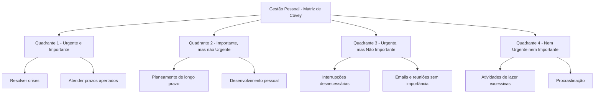

# VyT

---

**VyT** _(Value you Time)_ é um gerênciador de tarefas inteligente desenvolvido em ambito universitário
[IADE](https://www.iade.europeia.pt/) com o intuito de gerir as tarefas, onde organiza e prioriza as tarefas de acordo
com a sua importância e urgência, utilizando a [_**Matriz de matriz de Covey**_](#matriz).

---

### Trabalho a ser realizado por

<details>
 <summary> <B> Alunos </B> </summary>

| Nome           | Nº de Estudante |
|----------------|-----------------|
| Sebastião Rusu | 20220905        |
| Tomás Lebre    | 20220907        |
| José Franco    | 20220837        |

</details>

---

### Matriz Utilizada <a id="matriz"></a>

<details>
 <summary> <B> Matriz </B> </summary>

### Matriz de Covey

A _matriz de Covey_ é uma ferramenta de gestão de tempo que ajuda a priorizar tarefas e atividades de acordo com a sua
importância e urgência.



Uma explicação melhor da Matriz de Covey [aqui](https://www.flowup.me/blog/matriz-de-covey/)
</details>

---

### Um caso de _Use Case_

<details>

 <summary> <B> Use Case </B> </summary>

### _Use Case_

```mermaid
    flowchart TD
    A("User") --> B("Use Case") & Feed("Feedback")
    B --> C["No time for tasks"]
    C --> D{{"WebAPP VYT"}}
    D --> E["insert tasks"]
    E --> F["Tasks organized for user"]
    F --> A
    Feed -- Bad --> Bad("Reorganize")
    Feed -- Good --> Good("Finish")
    Bad --> F
   ```

</details>

---

### Ferramentas Utilizadas

<details>
<summary> <B> Ferramentas </B> </summary>

---

<details>
    <summary> <B> Frontend </B> </summary>

**React - Typescript + bootstrap**

<details>
    <summary> <B> Documentação </B> </summary>

  - [React](https://reactjs.org/)
  - [Typescript](https://www.typescriptlang.org/)
  - [Bootstrap](https://getbootstrap.com/)
</details>


</details>

---

<details>
    <summary> <B> Backend </B> </summary>

**Springboot Maven(Java) + postgresql + Docker** <br>
**Nginx**
<details>
    <summary> <B> Documentação </B> </summary>

- [Springboot](https://spring.io/projects/spring-boot)
- [Maven](https://maven.apache.org/)
- [Java](https://www.java.com/pt-BR/)
- [Postgresql](https://www.postgresql.org/)
- [Docker](https://www.docker.com/)
- [Nginx](https://www.nginx.com/)
</details>


</details>

---

</details>

